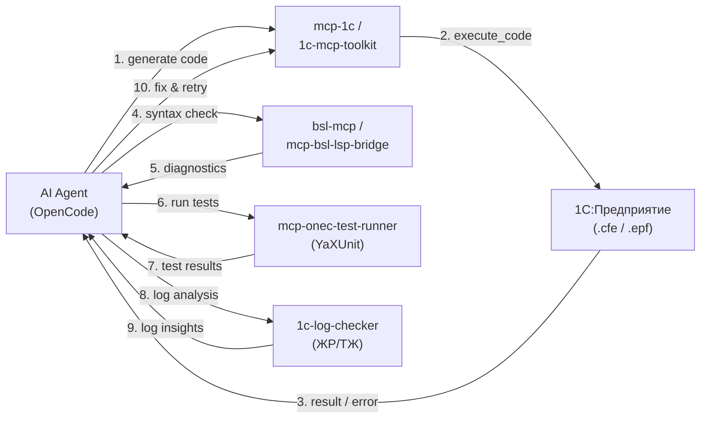

# 1C MCP — интеграция с AI-ассистентами

> Полный реестр MCP-решений для 1С:Предприятие.
> Фокус: двусторонний канал AI ↔ 1С для тестирования и отладки генерируемого кода.
> Актуализировано: май 2026

---

## Содержание

1. [Топология сети](#топология)
2. [Полный реестр MCP-решений](#полный-реестр-mcp-решений)
   - 2.1 [Фреймворки](#21-фреймворки)
   - 2.2 [Метаданные и анализ кода](#22-метаданные-и-анализ-кода)
   - 2.3 [Справка и документация](#23-справка-и-документация)
   - 2.4 [Тестирование и LSP](#24-тестирование-и-lsp)
   - 2.5 [Интеграции и API](#25-интеграции-и-api)
   - 2.6 [1С:Напарник](#26-1снапарник)
   - 2.7 [Учётные системы](#27-учётные-системы)
   - 2.8 [Графовый анализ](#28-графовый-анализ)
   - 2.9 [IDE-интеграции](#29-ide-интеграции)
   - 2.10 [Инфраструктура и DevOps](#210-инфраструктура-и-devops)
   - 2.11 [Наборы правил и Skills](#211-наборы-правил-и-skills)
   - 2.12 [Коммерческие продукты](#212-коммерческие-продукты)
   - 2.13 [Каталоги (awesome-list)](#213-каталоги)
3. [Сводная таблица (30×10)](#сводная-таблица)
4. [Архитектурные паттерны](#архитектурные-паттерны)
5. [Матрица совместимости](#матрица-совместимости)
6. [Сценарий: двусторонний канал AI ↔ 1С для тестирования](#сценарий-двусторонний-канал)
7. [Карта пробелов](#карта-пробелов)
8. [Рекомендация: ТОП-3 стека](#рекомендация-топ-3-стека)
9. [Итоговый конфиг OpenCode](#итоговый-конфиг-opencode)

---

## Топология

```
IP_A (Windows Server)          IP_B (Ubuntu AI Agent)
─────────────────────          ──────────────────────────────
Apache + 1С Платформа          OpenCode + MCP бинарники
     │                              │
     │  HTTP: http://IP_A/<pub>/hs/*│
     │◄─────────────────────────────┤
     │                              │
     │                    Локальные MCP-серверы
     │                    подключаются к IP_A
```

---

## Полный реестр MCP-решений

### 2.1 Фреймворки

Инструменты для создания собственных MCP-серверов внутри 1С.

| Проект | ★ | Язык | Транспорт | Tools | Зависимости | Статус |
|--------|---|------|-----------|-------|-------------|--------|
| [1c\_mcp](https://github.com/vladimir-kharin/1c_mcp) | 405 | 1C+Python | HTTP, stdio | фреймворк | 1С 8.3+, Python 3 | ✅ Active |
| [1c-mcp-toolkit](https://github.com/ROCTUP/1c-mcp-toolkit) | 138 | 1C+Python | HTTP | 13 | .epf, Python (опц.) | ✅ Active |
| [http1c](https://mcpmarket.com/server/http1c) | — | 1C+C/C++ | SSE, Streamable HTTP | фреймворк | Нативная компонента | ✅ Active |

### 2.2 Метаданные и анализ кода

| Проект | ★ | Язык | Транспорт | Tools | Суть |
|--------|---|------|-----------|-------|------|
| [mcp-1c](https://github.com/feenlace/mcp-1c) | 103 | Go+1C | stdio | 9 | Один бинарник, zero-deps, метаданные + запросы |
| [mcp-1c-v1](https://github.com/FSerg/mcp-1c-v1) | 152 | TypeScript | Streamable HTTP | RAG | Семантический поиск через Qdrant |
| [1c-mcp-metacode](https://github.com/ROCTUP/1c-mcp-metacode) | 71 | Python | stdio | 3 | Граф метаданных в Neo4j |
| [1C\_MCP\_metadata](https://github.com/artesk/1C_MCP_metadata) | — | 1C+PowerShell | stdio | — | PowerShell-мост для метаданных |
| [1c-templates-mcp](https://yellowmcp.com/servers/1c-templates-mcp) | — | Python | SSE | 2200+ шаблонов | Поиск по шаблонам BSL-кода |

### 2.3 Справка и документация

| Проект | ★ | Язык | Транспорт | Tools | Суть |
|--------|---|------|-----------|-------|------|
| [mcp-bsl-platform-context](https://github.com/alkoleft/mcp-bsl-platform-context) | 169 | Kotlin | stdio, SSE | поиск | Синтакс-помощник 1С для AI |
| [onec-help-mcp](https://github.com/rzateev/onec-help-mcp) | — | Python | MCP, REST | поиск | RAG по справке (BM25 + семантика) |
| [1c-syntax-helper-mcp](https://github.com/Antonio1C/1c-syntax-helper-mcp) | — | Python | HTTP | поиск | Elasticsearch-поиск по .hbk |

### 2.4 Тестирование и LSP

| Проект | ★ | Язык | Транспорт | Tools | Суть |
|--------|---|------|-----------|-------|------|
| [bsl-mcp](https://github.com/phsin/mcp-bsl-ls) | 94 | Python | stdio | анализ BSL | Линтер через BSL Language Server |
| [mcp-bsl-lsp-bridge](https://github.com/SteelMorgan/mcp-bsl-lsp-bridge) | — | — | MCP | 100+ проверок | LSP→MCP транслятор |
| [mcp-onec-test-runner](https://github.com/alkoleft/mcp-onec-test-runner) | 95 | Kotlin | stdio | сборка+тесты | Запуск YaXUnit-тестов |
| [rlm-tools-bsl](https://github.com/Dach-Coin/rlm-tools-bsl) | 94 | Python | stdio | 55 хелперов | SQLite-индекс для BSL |

### 2.5 Интеграции и API

| Проект | ★ | Язык | Суть |
|--------|---|------|------|
| [OpenIntegrations](https://github.com/Bayselonarrend/OpenIntegrations) | 616 | 1C+BSL | 30+ API (TG, VK, Google, Yandex, S3, SQL...) |
| [1c-rest-mcp](https://github.com/theYahia/1c-rest-mcp) | 4 | TypeScript | REST API / OData для 1С, 9 tools |

### 2.6 1С:Напарник

| Проект | ★ | Язык | Суть |
|--------|---|------|------|
| [1c-buddy](https://github.com/ROCTUP/1c-buddy) | 138 | JS+Python | Чат + MCP + OpenAI-шлюз к code.1c.ai |
| [spring-mcp-1c-copilot](https://github.com/SteelMorgan/spring-mcp-1c-copilot) | — | Kotlin | Spring Boot SSE bridge к Напарнику |

### 2.7 Учётные системы

| Проект | ★ | Язык | Суть |
|--------|---|------|------|
| [1c-accounting-mcp](https://github.com/tarasov46/1c-accounting-mcp) | — | Python+JS | Бухгалтерия, experimental |

### 2.8 Графовый анализ

| Проект | ★ | Язык | Суть |
|--------|---|------|------|
| [bsl-graph](https://github.com/alkoleft/bsl-graph) | — | Kotlin | NebulaGraph + Sigma.js визуализация |

### 2.9 IDE-интеграции

| Проект | ★ | Язык | Суть |
|--------|---|------|------|
| [EDT-MCP](https://github.com/DitriXNew/EDT-MCP) | 161 | Java | Плагин для 1C:EDT, Streamable HTTP |
| [CodePilot1C](https://github.com/ondysss/codepilot1c-edt) | — | Java | Чат + MCP Host внутри EDT |
| [1C: Platform Tools MCP](https://github.com/yellow-hammer/mcp-1c-platform-tools) | — | TypeScript | Мост к VS Code-расширению |

### 2.10 Инфраструктура и DevOps

| Проект | ★ | Язык | Суть |
|--------|---|------|------|
| [compose4mcp](https://github.com/pravets/compose4mcp) | — | Docker Compose | Оркестрация 8+ MCP-серверов |
| [v8-session-manager](https://github.com/1c-neurofish/v8-session-manager) | — | Rust | Агрегатор WS-сессий 1С → единый MCP endpoint |
| [1c-log-checker](https://github.com/SteelMorgan/1c-log-checker) | — | — | ЖР/ТЖ → ClickHouse + Grafana |
| [1c-ai-sandbox](https://github.com/SteelMorgan/1c-ai-sandbox-client-server) | — | Docker | Изолированная песочница 1С для AI |
| [1c-lsp-mcp-skill](https://github.com/fserg/1c-lsp-mcp-skill) | 20 | Rust | MCP-bridge для bsl-language-server |
| [MCP35](https://github.com/infaton/MCP35) | 13 | 1C | 35 tools для 1С:Enterprise ERP |

### 2.11 Наборы правил и Skills

| Проект | Суть |
|--------|------|
| [Unica](https://github.com/IngvarConsulting/unica) | Codex plugin: skills, .mcp.json, сценарии для 1С |
| [cursor\_rules\_1c](https://github.com/comol/cursor_rules_1c) | 11 AI-агентов, 24+ скилла, каталог антипаттернов |
| [1C: Platform Tools Skills](https://marketplace.visualstudio.com/items?itemName=yellow-hammer.1c-platform-tools) | Installable SKILL.md для Cursor/Copilot/Claude |

### 2.12 Коммерческие продукты

| Проект | Категория | Цена |
|--------|-----------|------|
| [OneMCP](https://onemcp.ru) | SaaS-платформа | Бета (free) |
| [ARQA MCP Server](https://arqa.cc/ru/mcp-server) | Бизнес-операции | Paid |
| [OneRPA MCP Suite](https://docs.onerpa.ru/mcp-servery-1c) | Набор из 9 серверов | Paid |
| [VibeCoding1C](http://vibecoding1c.ru) | Конструктор MCP-серверов | 9 000 руб. |
| [Infostart MCP](https://infostart.ru) | Метаданные + синтаксис | Paid |

### 2.13 Каталоги

| Проект | Суть |
|--------|------|
| [Untru/1c-mcp](https://github.com/Untru/1c-mcp) | ★90 — curated list MCP-серверов для 1С |

---

## Архитектурные паттерны

### Прямое подключение к базе

```
AI Agent ◄── MCP ──► Go/Python бинарник ◄── HTTP ──► 1С (расширение .cfe или .epf)
                                                          │
                                                     HTTP-сервис / встроенный сервер
                                                          ▼
                                                     База 1С
```

**Серверы:** `mcp-1c`, `1c-mcp-toolkit`, `1c_mcp`

### Офлайн-анализ выгрузки

```
AI Agent ◄── MCP ──► MCP-сервер ◄──► Neo4j / Qdrant
                                           ▲
                                           │
                                      Выгрузка .xml / .txt
                                      с конфигурации 1С (Windows)
```

**Серверы:** `1c-mcp-metacode`, `mcp-1c-v1`, `bsl-graph`

### RAG / семантический поиск

```
AI Agent ◄── MCP ──► MCP-сервер ◄──► Векторная БД (Qdrant / Elasticsearch)
                                           ▲
                                           │
                                    Embedding Service
```

**Серверы:** `mcp-1c-v1`, `onec-help-mcp`, `1c-syntax-helper-mcp`

### LSP → MCP мост

```
AI Agent ◄── MCP ──► mcp-bsl-lsp-bridge ◄── LSP ──► BSL Language Server (Java)
```

**Серверы:** `bsl-mcp`, `mcp-bsl-lsp-bridge`, `1c-lsp-mcp-skill`

### Мульти-сессионный агрегатор

```
                      ┌── 1С-клиент (WS) ──►
AI Agent ◄── MCP ──► v8-session-manager ──┼── 1С-клиент (WS) ──►
                      └── 1С-клиент (WS) ──►
```

**Серверы:** `v8-session-manager`

---

## Матрица совместимости

### По транспорту

| Транспорт | Серверы |
|-----------|---------|
| **stdio** | mcp-1c, 1c-mcp-metacode, bsl-mcp, mcp-onec-test-runner, mcp-bsl-platform-context, rlm-tools-bsl, 1c-rest-mcp |
| **SSE** | EDT-MCP, mcp-bsl-platform-context, 1c-templates-mcp, http1c, spring-mcp-1c-copilot |
| **Streamable HTTP** | EDT-MCP, mcp-1c-v1, 1c-rest-mcp, http1c, v8-session-manager, 1c-mcp-toolkit |
| **HTTP** | 1c-mcp-toolkit, 1c_mcp, CodePilot1C, 1c-syntax-helper-mcp, ARQA MCP Server |

### По платформе 1С

| Версия | Серверы |
|--------|---------|
| 8.2.13+ | 1c-mcp-toolkit |
| 8.3.10+ | mcp-onec-test-runner |
| 8.3.18+ | ARQA MCP Server |
| 8.3.20+ | mcp-bsl-platform-context |
| 8.3+ (общее) | mcp-1c, 1c_mcp, 1C_MCP_metadata |
| Не требуется | 1c-mcp-metacode, mcp-1c-v1, bsl-mcp, mcp-bsl-lsp-bridge, 1c-rest-mcp, bsl-graph, onec-help-mcp |

---

## Сценарий: двусторонний канал AI ↔ 1С для тестирования

### Цель

AI-агент (OpenCode/Claude/Cursor):
1. Пишет BSL-код (обработку, модуль, запрос)
2. Отправляет в 1С на исполнение
3. Получает результат/ошибку
4. Анализирует, исправляет, повторяет

### Пайплайн



### Пошаговый флоу

| Шаг | Действие AI | MCP-сервер | Инструмент |
|-----|------------|------------|------------|
| 1 | Получить контекст метаданных | `mcp-1c` | `get_metadata_tree`, `get_object_structure` |
| 2 | Получить справку по API | `mcp-bsl-platform-context` | `search_platform_context` |
| 3 | Написать BSL-код | — | — |
| 4 | Проверить синтаксис | `bsl-mcp` | `analyze_file`, `check_syntax` |
| 5 | Исполнить код в 1С | `1c-mcp-toolkit` | `execute_code`, `execute_query` |
| 6 | Прочитать журнал | `mcp-1c` или `1c-log-checker` | `get_event_log`, `search_logs` |
| 7 | Запустить YaXUnit-тесты | `mcp-onec-test-runner` | `run_tests`, `build_project` |
| 8 | Анализ ошибок, правка, retry | — | — |

### Ключевые пары «запись → чтение» для двустороннего канала

| Направление | Инструменты записи (Write) | Инструменты чтения (Read) |
|-------------|---------------------------|--------------------------|
| Метаданные | — | `get_metadata_tree`, `search_metadata`, `get_object_structure` |
| Код | `execute_code` (через 1c-mcp-toolkit) | `search_code`, `get_form_structure` |
| Данные | `execute_query` (INSERT/UPDATE в SQL или 1C) | `execute_query` (SELECT), `get_object_by_link` |
| Тесты | `build_project` | `run_tests` |
| Логи | — | `get_event_log`, `search_logs` (ClickHouse) |
| Формы | `generate_form` (через forms-server) | `get_form_structure`, `screenshot` |

---

## Карта пробелов

### Чего НЕ хватает в текущей экосистеме

| # | Пробел | Почему важно | Что нужно |
|---|--------|--------------|-----------|
| 1 | **Обратная связь по exec (streaming)** | execute_code сейчас синхронный, нет progress | Streaming-протокол выполнения |
| 2 | **Multi-agent coordination** | Нет координации между разными MCP-серверами | Router/Orchestrator MCP |
| 3 | **CI/CD pipeline** | Нет интеграции с GitHub Actions/GitLab CI | MCP-триггеры на коммит |
| 4 | **Diff-анализ кода** | Нет сравнения версий модулей | Инструмент `diff_code` |
| 5 | **Сессии с песочницей** | 1c-ai-sandbox experimental, нестабилен | Стабильная изолированная среда |
| 6 | **Мониторинг MCP-серверов** | Нет healthcheck/uptime | Prometheus exporter для MCP |
| 7 | **Codegen форм** | Только OneRPA FormsServer | Открытый генератор XML-форм |
| 8 | **OTS-интеграция** | Нет прямого канала к техподдержке | MCP-сервер для OTS |

---

## Рекомендация: ТОП-3 стека

### 🥇 Быстрый старт (30 мин)

```jsonc
[
  "mcp-1c (feenlace)"     // 9 tools — метаданные, запросы, справка
  "1c-mcp-toolkit (ROCTUP)" // execute_code — САМЫЙ ВАЖНЫЙ для отладки
  "bsl-mcp"               // проверка синтаксиса
]
```

**Почему:** Минимальный порог, закрывает 80% сценария «написал → проверил → исполнил → прочитал ошибку».

### 🥈 Полный цикл разработки (2-3 часа)

```jsonc
[
  "mcp-1c"                     // Online: метаданные + запросы
  "1c-mcp-toolkit"             // Online: execute_code + скриншоты
  "mcp-bsl-platform-context"   // Справка по платформе
  "mcp-onec-test-runner"       // YaXUnit-тесты
  "1c-mcp-metacode"            // Offline: граф метаданных
  "1c-buddy"                   // 1С:Напарник для code review
]
```

### 🥉 Максимум (1 день на настройку)

```jsonc
[
  // Весь стек 🥈 +
  "EDT-MCP"                    // Глубокая интеграция с EDT
  "compose4mcp"                // Оркестрация всех серверов
  "v8-session-manager"         // Мульти-сессия
  "cursor_rules_1c"            // Skills для Cursor
  "Unica"                      // Codex plugin + skills
  "OneRPA Suite"               // 9 Docker-серверов (коммерция)
]
```

---

## Сравнение серверов

| Сервер | Режим | Модифицирует конфигурацию | Нужен Apache | Свой порт | Язык | Инструментов |
|--------|-------|---------------------------|--------------|-----------|------|--------------|
| **mcp-1c** (feenlace) | Online | ✅ .cfe расширение | ✅ да | ❌ | Go | 9 |
| **1c-mcp-toolkit** (ROCTUP) | Online | ❌ .epf внешняя | ❌ нет | ✅ 6003 | Python | 13 |
| **vladimir-kharin/1c_mcp** | Online | ✅ .cfe расширение | ✅ да | Python прокси | 1C+Python | фреймворк |
| **1c-mcp-metacode** (ROCTUP) | Offline | ❌ не требуется | ❌ | ✅ 6001+Neo4j | Go | 3 |
| **1c-buddy** (ROCTUP) | Online | ❌ не требуется | ❌ | ✅ 6005 | JS | 3 |

---

## Детальное описание серверов

### 1. mcp-1c (feenlace) — первый этап

Базовый MCP-сервер. Один Go-бинарник, 9 готовых инструментов.

**Архитектура:**
```
AI (IP_B)                 1С (IP_A)
─────────────────         ───────────────────
mcp-1c (бинарник) ──►    .cfe расширение
     │                       │
     │  HTTP к /hs/mcp-1c    │  HTTP-сервис на Apache
     ▼                       ▼
               База 1С
```

**Инструменты (9):**
- `get_metadata_tree` — дерево метаданных
- `get_object_structure` — реквизиты, ТЧ, измерения
- `get_form_structure` — структура формы
- `get_configuration_info` — имя, версия, платформа
- `search_code` — полнотекстовый поиск (BM25/regex/exact)
- `bsl_syntax_help` — справка по BSL
- `execute_query` — выполнение SELECT
- `validate_query` — проверка синтаксиса запроса
- `get_event_log` — журнал регистрации

**Установка .cfe — 2 варианта:**

**Вариант А: Автоустановка (с IP_B)**
```bash
# Linux (IP_B) устанавливает расширение в базу на Windows
# требуется доступ к файловой базе или клиент-сервер
mcp-1c --install "\\\\IP_A\\путь\\к\\базе" --platform "C:\\Program Files\\1cv8\\8.3.XX.XXXX\\bin\\1cv8.exe"
```

**Вариант Б: Ручная на IP_A**
1. Скачать `MCP_Сервер.cfe` из https://github.com/feenlace/mcp-1c/releases
2. Конфигуратор → Расширения → Добавить → указать .cfe
3. Обновить конфигурацию БД
4. Конфигуратор → Администрирование → Публикация на веб-сервере
5. Отметить HTTP-сервис `mcp-1c`, опубликовать

**Запуск на IP_B (Ubuntu):**
```bash
wget https://github.com/feenlace/mcp-1c/releases/latest/download/mcp-1c-linux-amd64
chmod +x mcp-1c-linux-amd64
sudo mv mcp-1c-linux-amd64 /usr/local/bin/mcp-1c

# тест
mcp-1c --base "http://IP_A/buh/hs/mcp-1c"
```

**Конфиг OpenCode:**
```json
{
  "mcpServers": {
    "1c": {
      "command": "/usr/local/bin/mcp-1c",
      "args": ["--base", "http://IP_A/buh/hs/mcp-1c"]
    }
  }
}
```

---

### 2. 1c-mcp-toolkit (ROCTUP) — второй этап

Внешняя обработка .epf, НЕ расширение. Не меняет конфигурацию. 13 инструментов.

**Архитектура — встроенный сервер (рекомендуется):**
```
AI (IP_B) ◄── HTTP MCP/REST ──► .epf (IP_A)
                                    │
                               HTTP-сервер
                               внутри обработки
                               порт 6003
                               ▼
                          База 1С
```

**Инструменты (13):**
- `execute_query` — запросы на языке 1С
- `execute_code` — выполнение произвольного кода BSL
- `get_metadata` — метаданные базы
- `get_event_log` — журнал регистрации
- `get_object_by_link` / `get_link_of_object` — навигационные ссылки
- `find_references_to_object` — поиск ссылок на объект
- `get_access_rights` — права доступа
- `get_bsl_syntax_help` — справка по BSL
- `get_screenshot` — скриншот (только Windows)
- `restart_1c_session` / `close_1c_session` — управление сессией
- `submit_for_deanonymization` — деанонимизация

**Установка IP_A:**
1. Скачать `build/MCP_Toolkit.epf` из https://github.com/ROCTUP/1c-mcp-toolkit
2. Открыть в 1С: Файл → Открыть → выбрать .epf
3. В форме выбрать «Встроенный сервер»
4. Нажать «Запустить сервер»
5. HTTP-сервер запустится на порту 6003

**Запуск Python прокси на IP_B (опционально):**
```bash
python3 -m venv ~/venv/mcp-toolkit
source ~/venv/mcp-toolkit/bin/activate
pip install -r requirements.txt
python -m onec_mcp_toolkit_proxy --port 6003
```

**Конфиг OpenCode:**
```json
{
  "mcpServers": {
    "1c-toolkit": {
      "url": "http://IP_A:6003/mcp",
      "transport": "streamable-http"
    }
  }
}
```

---

### 3. vladimir-kharin/1c_mcp — третий этап (кастомные инструменты)

Фреймворк-расширение для создания СВОИХ MCP-инструментов внутри 1С.

**Архитектура:**
```
AI (IP_B) ◄── MCP ──► Python прокси ◄── HTTP ──► .cfe расширение
                                                       │
                                                 HTTP-сервис
                                                 на Apache
                                                 /hs/mcp/APIBackend
                                                       ▼
                                                  База 1С
```

**Когда развивать:**
- Нужны кастомные инструменты под свою конфигурацию
- Появилась повторяющаяся бизнес-задача → вынести в tool
- Требуется безопасность (логика внутри 1С, не в Python/Go)
- Нужны Resources (статический контекст) или Prompts (шаблоны)

**Структура разработки:**
```
Расширение MCP_Сервер.cfe
├── Подсистема mcp_КонтейнерыИнструментов
│   ├── Обработка1 (ваш инструмент)
│   │   ├── ДобавитьИнструменты()   ← описание tools
│   │   └── ВыполнитьИнструмент()    ← логика
│   └── Обработка2 (другой инструмент)
```

**Установка:**
```bash
# Python прокси на IP_B
python3 -m venv ~/venv/1c-mcp
source ~/venv/1c-mcp/bin/activate
pip install -r requirements.txt
python -m mcp_proxy \
  --onec-url "http://IP_A/buh/hs/mcp/APIBackend" \
  --port 6004
```

**Конфиг OpenCode:**
```json
{
  "mcpServers": {
    "1c-custom": {
      "url": "http://localhost:6004/mcp",
      "transport": "streamable-http"
    }
  }
}
```

---

### 4. 1c-buddy (ROCTUP) — четвёртый этап

Интеграция с 1С:Напарник (API code.1c.ai).

**Инструменты:**
- `ask_1c_ai` — общие вопросы по 1С
- `explain_1c_syntax` — объяснение объектов и синтаксиса
- `check_1c_code` — проверка кода на ошибки

**Установка на IP_B (без Docker — Node.js):**
```bash
git clone https://github.com/ROCTUP/1c-buddy
cd 1c-buddy
npm install
ONEC_BUDDY_TOKEN=your_token node dist/index.js
```

**С Docker:**
```bash
docker run -d \
  --name 1c-buddy \
  -p 6005:6005 \
  -e ONEC_BUDDY_TOKEN=your_token \
  roctup/1c-buddy
```

**Конфиг OpenCode:**
```json
{
  "mcpServers": {
    "1c-buddy": {
      "url": "http://localhost:6005/mcp",
      "transport": "streamable-http"
    }
  }
}
```

---

### 5. 1c-mcp-metacode (ROCTUP) — пятый этап (офлайн)

Загрузка метаданных в Neo4j для графового анализа конфигурации без подключения к базе.

**Архитектура:**
```
IP_B (Ubuntu)
┌─────────────────────────────┐
│ 1c-mcp-metacode :6001       │
│    │                        │
│    ├── Neo4j :7474/:7687    │
│    └── MCP сервер           │
│         │                   │
│         ▼                   │
│   ./data/prj1/              │
│   ├── metadata/*.txt        │
│   └── code/*.xml            │
└─────────────────────────────┘
```

**Подготовка файлов на IP_A:**
1. Конфигурация → Отчет по конфигурации → текстовый файл (Вся конфигурация)
2. Конфигурация → Выгрузить конфигурацию в файлы (XML)

**Установка на IP_B:**
```yaml
# docker-compose.yml
version: '3'
services:
  neo4j:
    image: neo4j:latest
    ports:
      - "7474:7474"
      - "7687:7687"
    environment:
      - NEO4J_AUTH=neo4j/password
    volumes:
      - neo4j_data:/data

  metacode:
    image: roctup/1c-mcp-metacode
    ports:
      - "6001:6001"
    depends_on:
      - neo4j
    environment:
      - NEO4J_HOST=neo4j
      - NEO4J_PASSWORD=password
      - PROJECT_NAME=buh
    volumes:
      - ./data:/data

volumes:
  neo4j_data:
```

```bash
mkdir -p data/prj1/metadata data/prj1/code
# скопировать файлы с IP_A в data/prj1/
docker compose up -d
```

**Требования:**
- RAM: 4 ГБ Neo4j + 6 ГБ на базу
- Загрузка: ~30 мин для типовой Бухгалтерии

**Инструменты (3):**
- `search_metadata` — поиск по структурным свойствам и связям
- `search_metadata_by_description` — семантический поиск по описаниям
- `search_code` — поиск процедур/функций по описаниям

**Конфиг OpenCode:**
```json
{
  "mcpServers": {
    "1c-metacode": {
      "url": "http://localhost:6001/mcp",
      "transport": "streamable-http"
    }
  }
}
```

---

## Сводная таблица по режимам

| Режим | Сервер | Транспорт | Зависимости | Tools |
|-------|--------|-----------|-------------|-------|
| **Online** (живая база) | mcp-1c | stdio+HTTP (через Go) | .cfe + Apache | 9 |
| **Online** (живая база) | 1c-mcp-toolkit | HTTP встроенный | .epf + ничего | 13 |
| **Online** (живая база) | vladimir-kharin/1c_mcp | HTTP+Python прокси | .cfe + Apache | фреймворк |
| **Online** | 1c-buddy | HTTP | Токен code.1c.ai | 3 |
| **Online** | OpenIntegrations | CLI+MCP | 1С+BSL | 30+ API |
| **Online** | 1c-rest-mcp | stdio, Streamable HTTP | Node.js | 9 |
| **Online** | MCP35 | HTTP | 1С 8.3 | 35 |
| **Online** | ARQA MCP Server | HTTP (коммерч.) | 1С 8.3.18+ | бизнес |
| **Online (IDE)** | EDT-MCP | Streamable HTTP, SSE | EDT 2025.2+ | AST+формы |
| **Online (IDE)** | 1C: Platform Tools MCP | stdio (IPC) | VS Code/Cursor | команды |
| **Multi-session** | v8-session-manager | WS + Streamable HTTP | Rust бинарник | агрегатор |
| **Offline** (файлы) | 1c-mcp-metacode | stdio | Neo4j + данные с IP_A | 3 |
| **Offline** (RAG) | mcp-1c-v1 | Streamable HTTP | Docker + Qdrant | RAG-поиск |
| **Offline** (RAG) | onec-help-mcp | MCP, REST | Docker + Qdrant | RAG-поиск |
| **Offline** (LSP) | bsl-mcp | stdio | JRE 8+ | анализ BSL |
| **Offline** (LSP) | mcp-bsl-lsp-bridge | MCP | BSL Language Server | 100+ проверок |
| **Offline** (тесты) | mcp-onec-test-runner | stdio | JDK 17+, YaXUnit | сборка+тесты |
| **Orchestration** | compose4mcp | Docker Compose | Docker | 8+ серверов |

---

## Подготовка с IP_A (Windows)

| Для сервера | Что сделать |
|-------------|-------------|
| **mcp-1c** | Установить .cfe, опубликовать `/hs/mcp-1c` |
| **1c-mcp-toolkit** | Открыть .epf, запустить встроенный сервер (порт 6003) |
| **vladimir-kharin/1c_mcp** | Установить .cfe, опубликовать `/hs/mcp/APIBackend`, запустить Python прокси |
| **1c-mcp-metacode** | Выгрузить ОтчетПоКонфигурации.txt + XML выгрузку → скопировать на IP_B |
| **1c-buddy** | Получить токен code.1c.ai |
| **EDT-MCP** | Установить плагин в 1C:EDT (update site) |
| **1C: Platform Tools** | Установить расширение VS Code / Cursor |
| **OneRPA Suite** | Docker-compose на IP_B |
| **OpenIntegrations** | Скачать .cfe, установить расширение |
| **MCP35** | Установить .epf, запустить HTTP-сервер |

---

## Порядок развертывания (от малого → полному циклу)

| Этап | Сервер | Зачем | Время |
|------|--------|-------|-------|
| 1 | **mcp-1c** | 9 базовых tools, быстрый старт | 30 мин |
| 2 | **1c-mcp-toolkit** | execute_code — ключ для отладки генерируемого кода | 15 мин |
| 3 | **bsl-mcp** | Проверка синтаксиса перед отправкой в 1С | 15 мин |
| 4 | **vladimir-kharin/1c_mcp** | Кастомные инструменты под свои задачи | по необходимости |
| 5 | **mcp-bsl-platform-context** | Справка по платформе для генерации кода | 20 мин |
| 6 | **1c-buddy** | 1С:Напарник для code review | 10 мин |
| 7 | **mcp-onec-test-runner** | YaXUnit-тесты для генерируемого кода | 30 мин |
| 8 | **1c-mcp-metacode** | Офлайн-анализ, граф метаданных | 1 час с загрузкой |
| 9 | **compose4mcp** | Оркестрация всех серверов в Docker | 30 мин |

### Рекомендуемый минимальный стек для двустороннего канала

```jsonc
[
  "mcp-1c",            // чтение метаданных + запросы
  "1c-mcp-toolkit",    // execute_code (запись в 1С)
  "bsl-mcp"            // проверка синтаксиса
]
```

Эти три сервера закрывают цикл: **генерация → проверка → исполнение → чтение результата**.

---

## Итоговый конфиг OpenCode (минимальный стек)

```json
{
  "mcpServers": {
    "1c": {
      "command": "/usr/local/bin/mcp-1c",
      "args": ["--base", "http://IP_A/buh/hs/mcp-1c"]
    },
    "1c-toolkit": {
      "url": "http://IP_A:6003/mcp",
      "transport": "streamable-http"
    },
    "bsl-mcp": {
      "command": "python3",
      "args": ["-m", "mcp_bsl_ls"]
    }
  }
}
```

### Полный конфиг (все серверы)

```json
{
  "mcpServers": {
    "1c": {
      "command": "/usr/local/bin/mcp-1c",
      "args": ["--base", "http://IP_A/buh/hs/mcp-1c"]
    },
    "1c-toolkit": {
      "url": "http://IP_A:6003/mcp",
      "transport": "streamable-http"
    },
    "1c-custom": {
      "url": "http://localhost:6004/mcp",
      "transport": "streamable-http"
    },
    "1c-buddy": {
      "url": "http://localhost:6005/mcp",
      "transport": "streamable-http"
    },
    "1c-metacode": {
      "url": "http://localhost:6001/mcp",
      "transport": "streamable-http"
    },
    "bsl-lint": {
      "command": "python3",
      "args": ["-m", "mcp_bsl_ls"]
    },
    "1c-test-runner": {
      "command": "java",
      "args": ["-jar", "mcp-onec-test-runner.jar"]
    },
    "1c-platform-help": {
      "command": "java",
      "args": ["-jar", "mcp-bsl-platform-context.jar"]
    }
  }
}
```

---

## Источники данных

| Источник | Результат |
|----------|-----------|
| [Untru/1c-mcp](https://github.com/Untru/1c-mcp) | ★90 — основной каталог (25+ проектов) |
| [OpenIntegrations](https://github.com/Bayselonarrend/OpenIntegrations) | ★616 — API-интеграции с MCP-режимом |
| [GitHub API](https://api.github.com/search/repositories?q=1%D0%A1+MCP&sort=stars) | 57 репозиториев по запросу `1С+MCP` |
| [Smithery](https://smithery.ai) | Специфичных 1С-серверов не найдено |
| [PulseMCP](https://pulsemcp.com) | 403 — требует JS или API-доступ |
| [Инфостарт](https://infostart.ru/public/all/?search=mcp) | JS-рендеринг, результаты не извлечены |
| [Habr](https://habr.com/ru/search/?q=MCP+%D0%B4%D0%BB%D1%8F+1%D0%A1) | Публикаций по запросу не найдено |
