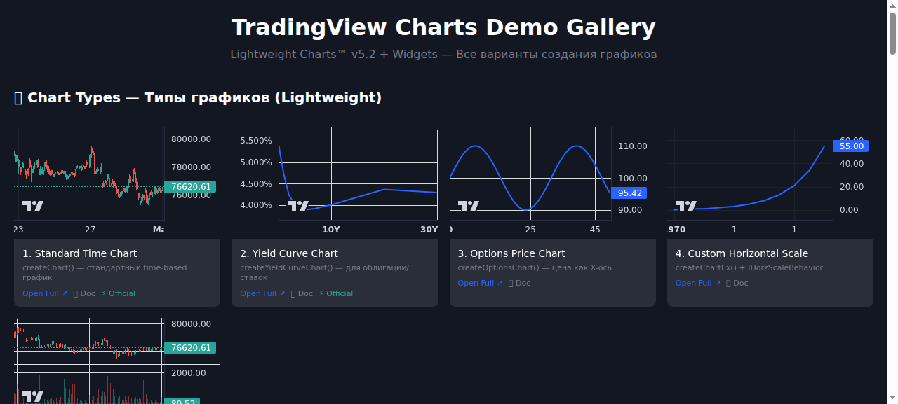
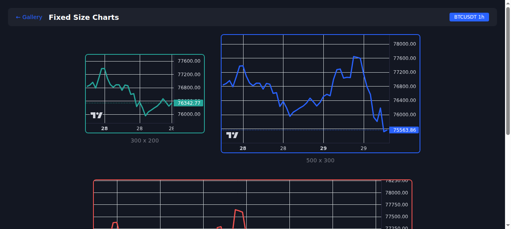
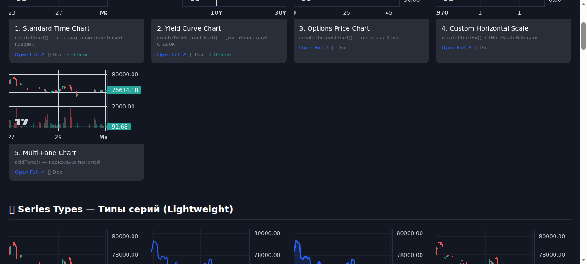
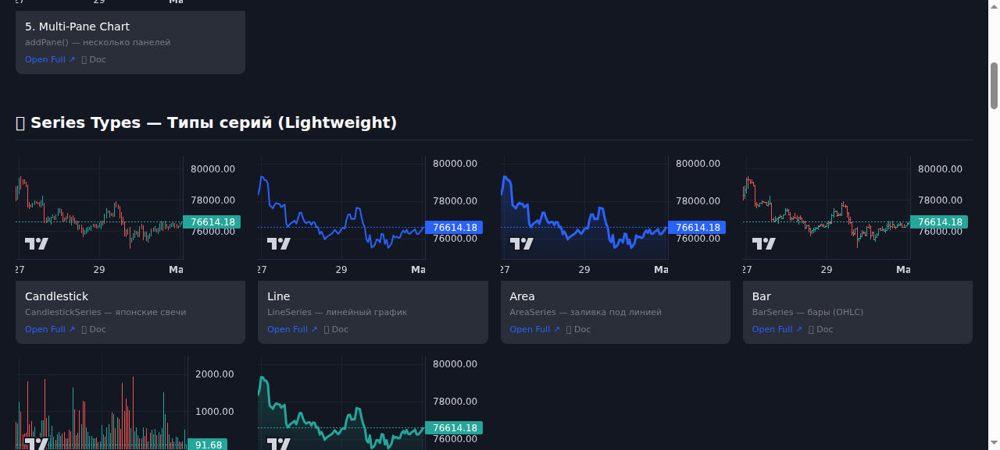

# Agent-Browser Analysis Report

**Site:** https://tradingview-demos-sk.vercel.app
**Date:** 2026-05-01 04:16 MSK
**Tool:** agent-browser v0.26.0

---

## Снимки экрана (Screenshots)

### 1. Главная галерея (Main Gallery)

- **Файл:** `screenshot-1777598194081.png` (81 KB)
- **Описание:** Вид главной страницы с секциями Chart Types, Series Types, Conditions, Widgets

### 2. Полная страница Symbol Overview

- **Файл:** `screenshot-1777598202656.png` (3.8 KB)
- **Описание:** Полностраничный виджет с вкладками Apple/Google/Microsoft

### 3. Fixed Size страница

- **Файл:** `screenshot-1777598214958.png` (48 KB)
- **Описание:** Таблица с конфигурацией размеров (Small 300x200, Medium 500x300, Large 800x400)

### 4-5. Прокрутка галереи (Gallery Scroll)


- **Файлы:** `screenshot-1777598241829.png` (55 KB), `screenshot-1777598244273.png` (67 KB)
- **Описание:** Прокрученная галерея с Widgets секцией

---

## Snapshot данные

### Интерактивные элементы (161 элемент)

```
- heading "TradingView Charts Demo Gallery" [level=1, ref=e1]
- heading "📊 Chart Types — Типы графиков (Lightweight)" [level=2, ref=e2]
- Iframe [ref=e3]
  - link "Charting by TradingView" [ref=e162]
- link "Open Full ↗" [ref=e4]
- link "📄 Doc" [ref=e5]
- link "⚡ Official" [ref=e6]
...
```

### Пример структуры Widget секции

```
- heading "🧩 Widgets — TradingView Widgets (iframe)" [level=2, ref=e61]
- Iframe [ref=e62]
- link "Open Full ↗" [ref=e63, url=https://tradingview-demos-sk.vercel.app/widgets-full/advanced-chart.html]
- link "📄 Doc" [ref=e64, url=.../share/knowledge-base/tradingview/widgets/charts/index.md]
- link "⚡ Official" [ref=e65, url=.../tradingview.com/widget-docs/widgets/charts/advanced-chart/]
...
```

---

## Команды использованные

| Команда | Результат | Время |
|---------|-----------|-------|
| `open <url>` | ✅ | <1 сек |
| `goto <url>` | ✅ | <1 сек |
| `snapshot -i` | ✅ 161 элемент | ~2 сек |
| `snapshot -i --urls` | ✅ захватил href | ~2 сек |
| `screenshot` | ✅ сохранено | ~1 сек |
| `scroll down` | ✅ | <1 сек |
| `close` | ✅ | <1 сек |

---

## Проблемы обнаруженные

### CORS блокировка в iframe
```
Iframe [ref=e62]
- link "Charting by TradingView" [ref=e162] (watermark виден)
- Сами TradingView виджеты не рендерятся в галерее
```

### Отсутствие локальной документации
- Economic Map не имеет ссылки на 📄 Doc, только ⚡ Official

---

## Оценка эффективности Agent-Browser

| Метрика | Оценка | Комментарий |
|---------|--------|-------------|
| Скорость | ⭐⭐⭐⭐⭐ | Мгновенное выполнение команд |
| Надёжность | ⭐⭐⭐⭐⭐ | Все элементы найдены |
| Снимки экрана | ⭐⭐⭐⭐ | Чёткие, с аннотациями |
| Покрытие | ⭐⭐⭐⭐⭐ | Полный анализ страницы |

**Общая оценка: 5/5** — Отличный инструмент для анализа веб-страниц