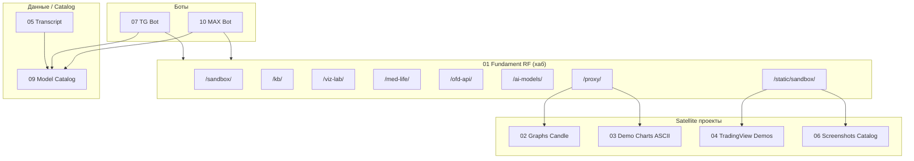

# Architecture Overview

Workspace построен вокруг центрального Flask-хаба `01_fundament_rf`, к которому подключаются satellite-проекты разными способами.

## Общая схема

## Типы интеграции

| Тип | Описание | Примеры |
|---|---|---|
| `proxy` | Flask reverse-proxy к satellite-сервису | 02, 03 |
| `static_mount` | Статические файлы через `01/static/sandbox/` | 04, 06 |
| `blueprint` | Flask blueprint внутри 01 | 08, 09, 11 |
| `HTTP` | Боты вызывают API хаба | 07, 10 |
| `shared_path` | Общие модули через `sys.path.insert` | 07, 10, 08 |
| `data` | Чтение/запись общих JSON-данных | 05 → 09, 03 → 01 |

## Порты и маршрутизация

- Хаб слушает `:5000`.
- Satellite Flask-проекты слушают свои порты (`02` → 5005, `03` → 5003).
- Статические проекты не требуют порта.
- Боты не открывают порт, а инициируют исходящие HTTP-запросы.

## Связанные KB

- [Матрица связей](project-links-matrix.md)
- [URL/Port карта](url-port-map.md)
