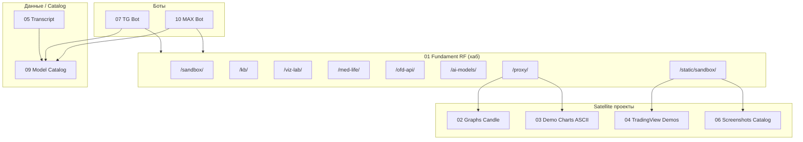
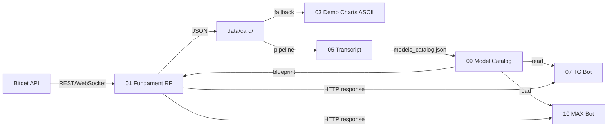
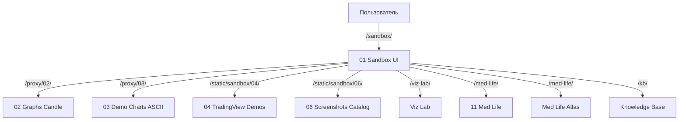
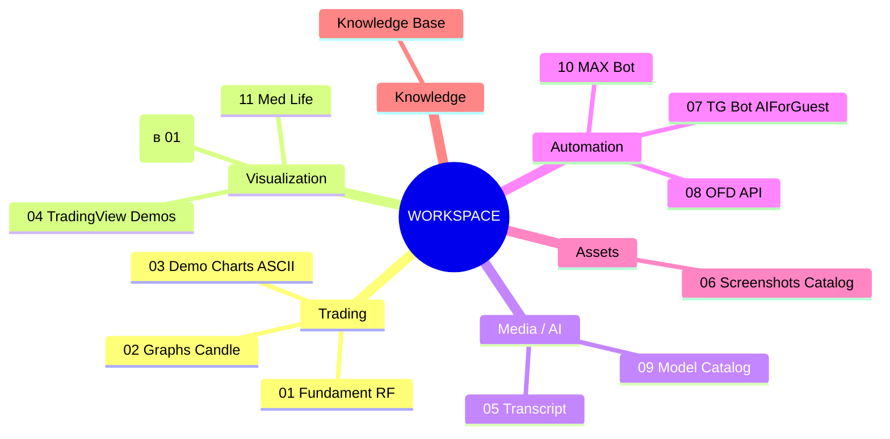
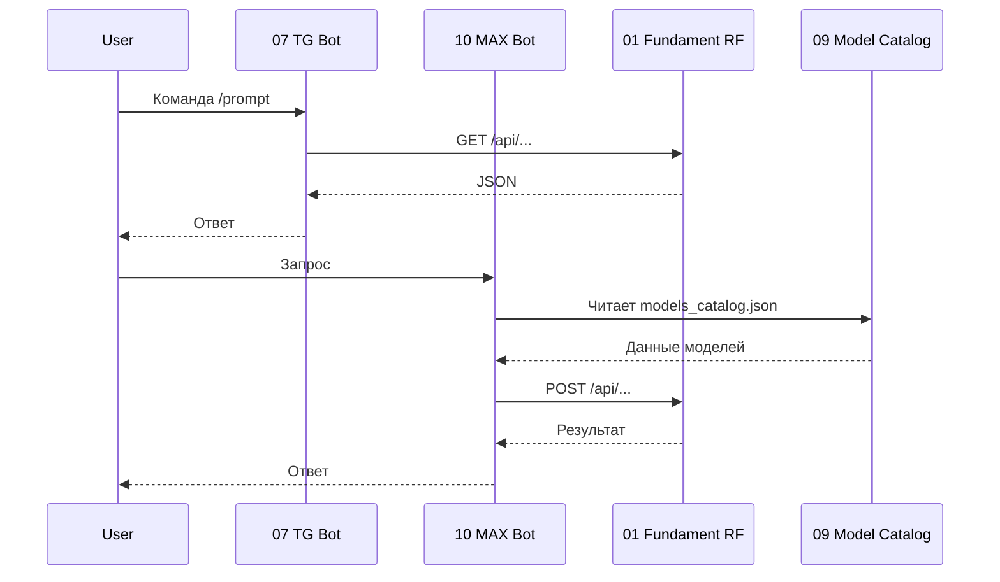

# Mermaid Diagrams

Коллекция Mermaid-диаграмм, описывающих архитектуру, связи и потоки данных workspace.

## 1. Общая архитектура

## 2. Потоки данных

## 3. Sandbox → Satellite

## 4. Mindmap доменов

## 5. Bot ↔ Hub interactions

## Связанные KB

- [Архитектура workspace](architecture-overview.md)
- [Матрица связей](project-links-matrix.md)
