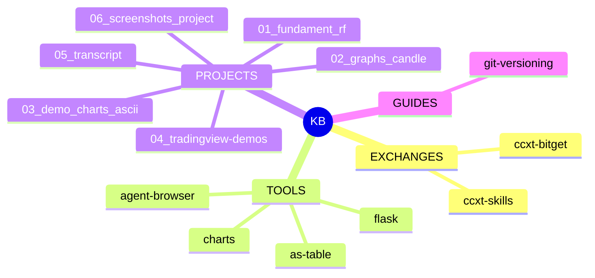

# Knowledge Base

Централизованная база знаний по проектам, API и инструментам.

## Структура workspace

```
workspace/
├── projects/              # проекты
├── skills/instructions/   # 👈 рабочие инструкции (router)
├── scripts/               # скрипты
├── tools/                 # утилиты
└── share/knowledge-base/  # эта база знаний
```

## ⚡ Router

При запросе по теме — сначала читай `skills/instructions/`:
- `git` → `skills/instructions/git.md`
- `vercel` → `skills/instructions/vercel.md`
- `flask` → `skills/instructions/flask.md`

## Mindmap



## Категории

| # | Раздел | Описание | Файлы |
|---|--------|----------|-------|
| 1 | `1-exchanges/` | API бирж, библиотеки | `ccxt-bitget.md`, `ccxt-skills/` |
| 2 | `2-tools/` | Утилиты | `as-table.md`, `agent-browser.md`, `charts.md`, `flask.md` |
| 3 | `3-projects/` | Проекты репозитория | `fundament-rf.md`, `graphs-candle.md`, `demo-charts-ascii.md` |
| 4 | `4-guides/` | Гайды и best practices | `git-versioning.md` |

## Навигация

- [ccxt Bitget — 56 методов, 4 режима](1-exchanges/ccxt-bitget.md)
- [ccxt Skills — Claude AI skills](1-exchanges/ccxt-skills/README.md)
- [as-table — ASCII таблицы в CLI](2-tools/as-table.md)
- [charts — CLI-графики](2-tools/charts.md)
- [agent-browser — браузерная автоматизация](2-tools/agent-browser.md)
- [flask — управление Flask-проектами](2-tools/flask.md)
- [fundament_rf — трекер сделок](3-projects/fundament-rf.md)
- [graphs_candle — свечные графики](3-projects/graphs-candle.md)
- [demo_charts_ascii — CLI-графики в Flask](3-projects/demo-charts-ascii.md)
- [Git-версионирование](4-guides/git-versioning.md)

## Связанное

- [Карта знаний workspace](../opencode/map_all.md) — mindmap всего репозитория
- [opencode.db](../opencode/opencode.db) — SQLite база для полнотекстового поиска
- [Рабочие инструкции](../../skills/instructions/) — router для агентов
