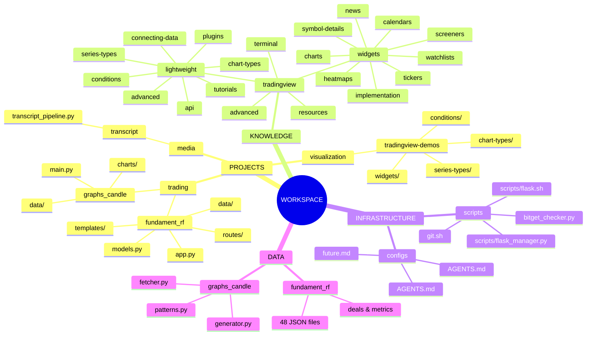
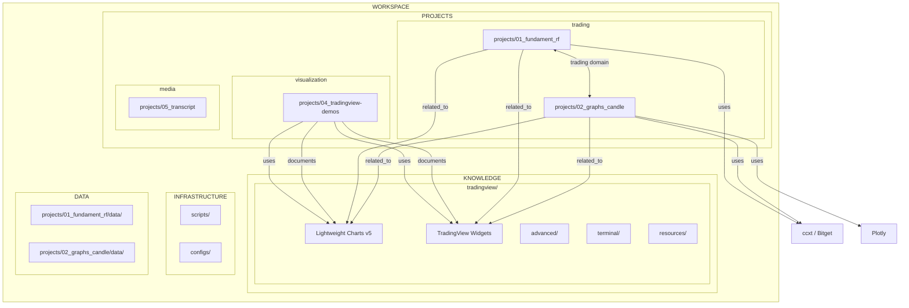

# Workspace Knowledge Map

**Версия:** 1.1
**Дата:** 2026-04-30
**Обновление:** `/scripts/update_knowledge_map.sh`

---

## 1. Mindmap (ОСНОВНОЙ)



---

## 2. Flowchart (диаграмма связей)



---

## 3. Hierarchical (иерархическая диаграмма)

```mermaid
hierarchical
    WORKSPACE
        PROJECTS
            trading
                fundament_rf
                graphs_candle
            visualization
                tradingview-demos
            media
                transcript
        KNOWLEDGE
            tradingview
                lightweight
                widgets
                advanced
                terminal
                resources
        INFRASTRUCTURE
            scripts
            configs
        DATA
```

---

## 4. Tree View

```
WORKSPACE/
│
├── PROJECTS/
│   ├── trading/
│   │   ├── projects/01_fundament_rf/
│   │   │   ├── app.py              [entry point]
│   │   │   ├── models.py           [data models]
│   │   │   ├── routes/             [API, web, processor, graphics]
│   │   │   ├── templates/          [HTML templates]
│   │   │   ├── static/css/         [styles]
│   │   │   └── data/               [48 JSON files]
│   │   │
│   │   └── projects/02_graphs_candle/
│   │       ├── main.py             [entry point]
│   │       ├── charts/             [candlestick, pnl, combined, svg]
│   │       └── data/               [fetcher, generator, patterns]
│   │
│   ├── visualization/
│   │   └── projects/04_tradingview-demos/
│   │       ├── index.html         [gallery]
│   │       ├── chart-types/       [5 types]
│   │       ├── series-types/      [7 types]
│   │       ├── conditions/        [8 conditions]
│   │       └── widgets/           [5 demos: charts, tickers, etc.]
│   │
│   └── media/
│       └── projects/05_transcript/
│           ├── transcript_pipeline.py
│           └── playlist_transcript.py
│
├── KNOWLEDGE/
│   └── tradingview/               [40 md files]
│       ├── index.md
│       ├── lightweight/           [Lightweight Charts]
│       │   ├── chart-types/       [5 files]
│       │   ├── series-types/      [7 files]
│       │   ├── conditions/        [8 files]
│       │   ├── connecting-data/   [1 file]
│       │   ├── plugins/           [1 file]
│       │   ├── tutorials/         [1 file]
│       │   ├── api/              [1 file]
│       │   └── advanced/          [2 files]
│       │
│       ├── widgets/              [TradingView Widgets]
│       │   ├── index.md
│       │   ├── charts/           [Advanced, Symbol Overview, Mini]
│       │   ├── watchlists/       [Market Summary, Overview, etc.]
│       │   ├── tickers/          [Ticker Tape, Single, Ticker]
│       │   ├── heatmaps/         [Stock, Crypto, ETF, Forex]
│       │   ├── screeners/        [Screener, Crypto Market]
│       │   ├── symbol-details/   [Info, Tech Analysis, etc.]
│       │   ├── news/             [Top Stories]
│       │   ├── calendars/        [Economic Calendar]
│       │   └── implementation/   [Embedding guide]
│       │
│       ├── advanced/             [Advanced Charts - private repo]
│       ├── terminal/             [Trading Platform]
│       └── resources/            [GitHub, External Links]
│
├── INFRASTRUCTURE/
│   ├── scripts/
│   │   ├── scripts/flask.sh
│   │   ├── scripts/flask_manager.py
│   │   ├── git.sh
│   │   ├── bitget_checker.py
│   │   └── update_knowledge_map.sh
│   │
│   └── configs/
│       ├── AGENTS.md
│       ├── AGENTS.md
│       └── future.md
│
└── DATA/
    ├── projects/01_fundament_rf/data/         [48 JSON files]
    └── projects/02_graphs_candle/data/        [Python modules]
```

---

## 5. JSON Structure

```json
{
  "version": "1.1",
  "updated": "2026-04-30",
  "workspace": {
    "path": "/home/user_aioc/workspace",

    "projects": {
      "projects/01_fundament_rf": {
        "path": "projects/01_fundament_rf/",
        "domain": "trading",
        "entry": "app.py",
        "technologies": ["Flask", "ccxt", "Bitget", "JSON"]
      },
      "projects/02_graphs_candle": {
        "path": "projects/02_graphs_candle/",
        "domain": "trading",
        "entry": "main.py",
        "technologies": ["Flask", "Plotly", "ccxt", "Bitget"]
      },
      "projects/04_tradingview-demos": {
        "path": "projects/04_tradingview-demos/",
        "domain": "visualization",
        "entry": "index.html",
        "technologies": ["Lightweight Charts v5", "TradingView Widgets", "JavaScript"]
      },
      "projects/05_transcript": {
        "path": "projects/05_transcript/",
        "domain": "media",
        "technologies": ["Python", "yt-dlp"]
      }
    },

    "knowledge_bases": {
      "tradingview": {
        "path": "share/knowledge-base/tradingview/",
        "files": 40,
        "sections": {
          "lightweight": {
            "description": "Lightweight Charts library",
            "subsections": ["chart-types", "series-types", "conditions", "plugins", "tutorials", "api", "advanced", "connecting-data"]
          },
          "widgets": {
            "description": "TradingView Widgets",
            "subsections": ["charts", "watchlists", "tickers", "heatmaps", "screeners", "symbol-details", "news", "calendars", "implementation"]
          },
          "advanced": {
            "description": "Advanced Charts (private repo)"
          },
          "terminal": {
            "description": "Trading Platform"
          },
          "resources": {
            "description": "GitHub issues, external links"
          }
        }
      }
    }
  }
}
```

---

## 6. Links Index

### Типы связей

| Тип | Описание | Направление |
|-----|----------|-------------|
| `related_to` | Общая предметная область | bidirectional |
| `uses` | Использует технологию/библиотеку | unidirectional |
| `documents` | Документирует проект | unidirectional |

### Project → Knowledge Base
| Проект | База знаний | Тип связи |
|--------|-------------|-----------|
| `fundament_rf` | `tradingview/lightweight/` | `related_to` |
| `fundament_rf` | `tradingview/widgets/` | `related_to` |
| `graphs_candle` | `tradingview/lightweight/` | `related_to` |
| `graphs_candle` | `tradingview/widgets/` | `related_to` |
| `tradingview-demos` | `tradingview/lightweight/` | `documents` |
| `tradingview-demos` | `tradingview/widgets/` | `documents` |

### Cross-Project
| Проект A | Проект B | Тип связи |
|----------|----------|-----------|
| `fundament_rf` | `graphs_candle` | `related_to` (trading domain) |

### Technology Links
| Проект | Технология | Тип связи |
|--------|------------|-----------|
| `fundament_rf` | `ccxt / Bitget` | `uses` |
| `graphs_candle` | `ccxt / Bitget` | `uses` |
| `graphs_candle` | `Plotly` | `uses` |
| `tradingview-demos` | `Lightweight Charts v5` | `uses` |
| `tradingview-demos` | `TradingView Widgets` | `uses` |

---

## 7. Update Instructions

### Автоматическое обновление

```bash
/home/user_aioc/workspace/scripts/update_knowledge_map.sh
```

### Ручное обновление

1. Отредактировать `/home/user_aioc/workspace/share/opencode/map_all.md`
2. Обновить секции:
   - **Mermaid диаграммы** (1-3) — при изменении структуры
   - **Tree View (4)** — при добавлении/удалении файлов
   - **JSON Structure (5)** — при изменении проектов или KB
   - **Links Index (6)** — при добавлении новых связей

### Проверка структуры

```bash
# Проверить все файлы карты
ls -la /home/user_aioc/workspace/share/opencode/

# Проверить KB
find /home/user_aioc/workspace/share/knowledge-base/tradingview -name "*.md" | wc -l

# Проверить Widget demos
find /home/user_aioc/workspace/projects/04_tradingview-demos/widgets -name "*.html" | wc -l
```

---

## Quick Navigation

| Секция | Описание |
|--------|----------|
| [Mindmap](#1-mindmap-основной) | Визуальная иерархия |
| [Flowchart](#2-flowchart-диаграмма-связей) | Диаграмма связей |
| [Hierarchical](#3-hierarchical-иерархическая-диаграмма) | Иерархическая диаграмма |
| [Tree View](#4-tree-view) | Древовидная структура |
| [JSON](#5-json-structure) | Машинно-читаемый формат |
| [Links](#6-links-index) | Индекс всех связей |
| [Update](#7-update-instructions) | Инструкции по обновлению |

### Knowledge Base
| Раздел | Путь | Файлов |
|--------|------|--------|
| `tradingview/` | `../knowledge-base/tradingview/` | 40 md |

### Projects
| Проект | Путь | Назначение |
|--------|------|------------|
| `projects/01_fundament_rf/` | `../projects/01_fundament_rf/` | Трекер сделок |
| `projects/02_graphs_candle/` | `../projects/02_graphs_candle/` | Свечные графики |
| `projects/04_tradingview-demos/` | `../projects/04_tradingview-demos/` | TradingView демо |
| `projects/05_transcript/` | `../projects/05_transcript/` | YouTube транскрипты |

---

## Version History

| Версия | Дата | Изменения |
|--------|------|-----------|
| 1.0 | 2026-04-30 | Первая версия |
| 1.1 | 2026-04-30 | Переструктуризация KB: добавлены widgets, advanced, terminal, resources; удалён tv/ |
