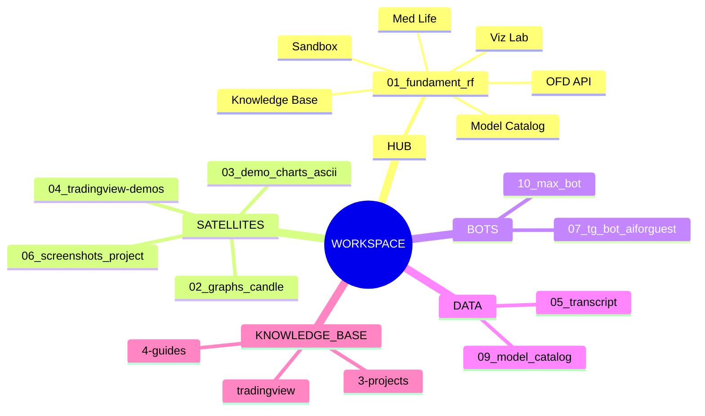

# Workspace Knowledge Map

**Версия:** 2.0
**Дата:** 2026-06-22
**Обновление:** `scripts/update_knowledge_map.sh`

---

## Mindmap

```mermaid
mindmap
  root((WORKSPACE))
    HUB
      01_fundament_rf
        Sandbox
        Knowledge Base
        Viz Lab
        Med Life
        OFD API
        Model Catalog
    SATELLITES
      02_graphs_candle
      03_demo_charts_ascii
      04_tradingview-demos
      06_screenshots_project
    BOTS
      07_tg_bot_aiforguest
      10_max_bot
    DATA
      05_transcript
      09_model_catalog
    KNOWLEDGE_BASE
      3-projects
      4-guides
      tradingview
```

---

## Проекты

| ID | Проект | Тип | Порт | Entry |
|---|---|---|---|---|
| 01 | fundament_rf | Flask hub | 5000 | `http://localhost:5000/` |
| 02 | graphs_candle | Flask | 5005 | `http://localhost:5005/` |
| 03 | demo_charts_ascii | Flask | 5003 | `http://localhost:5003/` |
| 04 | tradingview-demos | static | — | `/static/sandbox/04/index.html` |
| 05 | transcript | cli | — | `transcript_pipeline.py` |
| 06 | screenshots_project | static | — | `/static/sandbox/06/catalog.html` |
| 07 | tg_bot_aiforguest | bot | — | `./scripts/tg_bot.sh start` |
| 08 | ofd_api | blueprint | 5000 | `/ofd-api/` |
| 09 | model_catalog | blueprint/data | 5000 | `/ai-models/` |
| 10 | max_bot | bot | — | `scripts/max_bot.sh start` |
| 11 | med_life | atlas/blueprint | 5000 | `/med-life/` |

---

## Knowledge Base

| Раздел | Путь | Описание |
|---|---|---|
| README | `share/knowledge-base/README.md` | Навигация |
| Projects | `share/knowledge-base/3-projects/` | 11 проектов |
| Guides | `share/knowledge-base/4-guides/` | Архитектура, связи, модули |
| TradingView | `share/knowledge-base/tradingview/` | Playground |

---

## Связи

- `01` → `02`, `03` через `/proxy/`
- `01` → `04`, `06` через `/static/sandbox/`
- `07`, `10` → `01` через HTTP
- `08`, `09`, `11` — blueprint'ы внутри `01`
- `05` → `09` через `models_catalog.json`
- `03` → `01` fallback на `data/card/`
