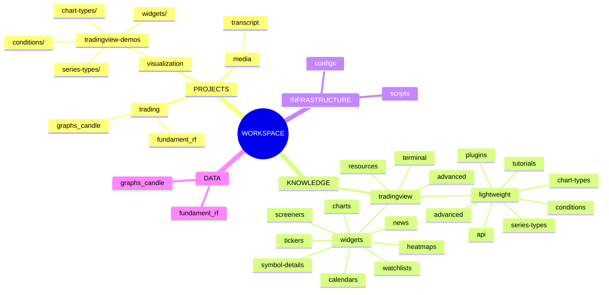

# Workspace Knowledge Map

**Версия:** 1.1
**Дата:** 2026-04-30
**Обновление:** см. `map_update.md`

---

## Модульная структура

Карта разделена на независимые файлы:

| Файл | Содержимое |
|------|------------|
| **[map_all.md](./map_all.md)** | Полная версия карты (все секции внутри) |
| **[map_mermaid.md](./map_mermaid.md)** | Flowchart + Hierarchical + Sequence + Pie |
| **[map_tree.md](./map_tree.md)** | Полная древовидная структура workspace |
| **[map_json.md](./map_json.md)** | JSON структура + межпроектные связи |
| **[map_links.md](./map_links.md)** | Полный индекс всех связей |
| **[map_update.md](./map_update.md)** | Инструкции по обновлению |

---

## Mindmap (основной вид)

---

## Quick Navigation

### Knowledge Base: tradingview/
| Раздел | Путь | Описание |
|--------|------|----------|
| `lightweight/` | [../lightweight/](../knowledge-base/tradingview/lightweight/) | Lightweight Charts v5 |
| `widgets/` | [../widgets/](../knowledge-base/tradingview/widgets/) | TradingView Widgets |
| `advanced/` | [../advanced/](../knowledge-base/tradingview/advanced/) | Advanced Charts (private) |
| `terminal/` | [../terminal/](../knowledge-base/tradingview/terminal/) | Trading Platform |
| `resources/` | [../resources/](../knowledge-base/tradingview/resources/) | GitHub, Links |

### Projects
| Проект | Путь | Назначение |
|--------|------|------------|
| `projects/01_fundament_rf/` | [../../projects/01_fundament_rf/](file:///home/user_aioc/workspace/projects/01_fundament_rf/) | Трекер сделок |
| `projects/02_graphs_candle/` | [../../projects/02_graphs_candle/](file:///home/user_aioc/workspace/projects/02_graphs_candle/) | Свечные графики |
| `projects/04_tradingview-demos/` | [../../projects/04_tradingview-demos/](file:///home/user_aioc/workspace/projects/04_tradingview-demos/) | TradingView демо |
| `projects/05_transcript/` | [../../projects/05_transcript/](file:///home/user_aioc/workspace/projects/05_transcript/) | YouTube транскрипты |

### Widget Demos
| Демо | Путь |
|------|------|
| Advanced Chart | [projects/04_tradingview-demos/widgets/charts/advanced-chart.html](file:///home/user_aioc/workspace/projects/04_tradingview-demos/widgets/charts/advanced-chart.html) |
| Mini Chart | [projects/04_tradingview-demos/widgets/charts/mini-chart.html](file:///home/user_aioc/workspace/projects/04_tradingview-demos/widgets/charts/mini-chart.html) |
| Ticker Tape | [projects/04_tradingview-demos/widgets/tickers/ticker-tape.html](file:///home/user_aioc/workspace/projects/04_tradingview-demos/widgets/tickers/ticker-tape.html) |
| Market Overview | [projects/04_tradingview-demos/widgets/watchlists/market-overview.html](file:///home/user_aioc/workspace/projects/04_tradingview-demos/widgets/watchlists/market-overview.html) |
| Technical Analysis | [projects/04_tradingview-demos/widgets/symbol-details/technical-analysis.html](file:///home/user_aioc/workspace/projects/04_tradingview-demos/widgets/symbol-details/technical-analysis.html) |

### Scripts
| Скрипт | Путь | Назначение |
|--------|------|------------|
| `update_knowledge_map.sh` | [../../scripts/update_knowledge_map.sh](../../scripts/update_knowledge_map.sh) | Обновление карты |

---

## Version History

| Версия | Дата | Изменения |
|--------|------|-----------|
| 1.0 | 2026-04-30 | Первая версия |
| 1.1 | 2026-04-30 | Переструктуризация KB: добавлены widgets, advanced, terminal, resources; удалён tv/ |
