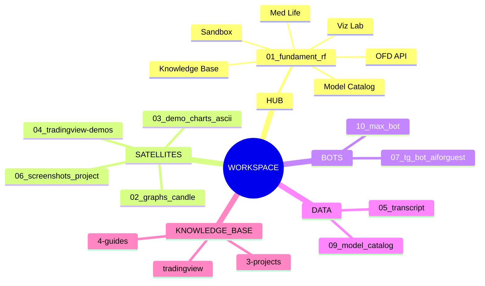

# Workspace Knowledge Map

**Версия:** 2.0
**Дата:** 2026-06-22
**Обновление:** `scripts/update_knowledge_map.sh`

---

## Модульная структура

Карта разделена на независимые файлы:

| Файл | Содержимое |
|---|---|
| **[map_all.md](./map_all.md)** | Полная версия карты |
| **[map_mermaid.md](./map_mermaid.md)** | Mermaid-диаграммы |
| **[map_tree.md](./map_tree.md)** | Древовидная структура |
| **[map_json.md](./map_json.md)** | JSON-структура |
| **[map_links.md](./map_links.md)** | Индекс связей |
| **[map_update.md](./map_update.md)** | Инструкции по обновлению |

---

## Mindmap

```mermaid
mindmap
  root((WORKSPACE))
    HUB
      01_fundament_rf
        Sandbox
        Knowledge Base
        Viz Lab
        Med Life
        OFD API
        Model Catalog
    SATELLITES
      02_graphs_candle
      03_demo_charts_ascii
      04_tradingview-demos
      06_screenshots_project
    BOTS
      07_tg_bot_aiforguest
      10_max_bot
    DATA
      05_transcript
      09_model_catalog
    KNOWLEDGE_BASE
      3-projects
      4-guides
      tradingview
```
