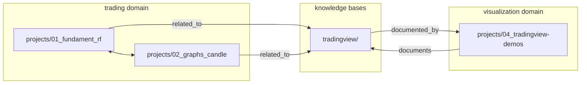

# Links Index

**Файл:** map_links.md
**Родительский:** [map_all_small.md](./map_all_small.md)

---

## Типы связей

| Тип | Описание | Направление |
|-----|----------|-------------|
| `related_to` | Общая предметная область | bidirectional |
| `uses` | Использует технологию/библиотеку | unidirectional |
| `documents` | Документирует проект | unidirectional |
| `documented_by` | Документируется проектом | unidirectional |
| `belongs_to` | Принадлежит домену | unidirectional |
| `depends_on` | Зависит от другого проекта | unidirectional |

---

## 1. Project → Knowledge Base

| Проект | База знаний | Тип связи | Описание |
|--------|-------------|-----------|---------|
| `fundament_rf` | `share/knowledge-base/tradingview/` | `related_to` | Trading domain |
| `graphs_candle` | `share/knowledge-base/tradingview/` | `related_to` | Charts/visualization |
| `tradingview-demos` | `share/knowledge-base/tradingview/` | `documents` | Демо документируют KB |
| `tradingview-demos` | `share/knowledge-base/tv/` | `documents` | Альтернативная документация |

---

## 2. Knowledge Base → Project

| База знаний | Проект | Тип связи | Описание |
|-------------|--------|-----------|---------|
| `share/knowledge-base/tradingview/` | `tradingview-demos` | `documented_by` | Демо как примеры |
| `share/knowledge-base/tv/` | `tradingview-demos` | `documented_by` | Альтернативные туториалы |

---

## 3. Cross-Project Links

| Проект A | Проект B | Тип связи | Описание |
|----------|----------|-----------|---------|
| `fundament_rf` | `graphs_candle` | `related_to` | trading domain |
| `tradingview-demos` | `graphs_candle` | `related_to` | visualization domain |

---

## 4. Technology Links

### Uses (проект → технология)

| Проект | Технология | Тип связи | Описание |
|--------|------------|-----------|---------|
| `fundament_rf` | `ccxt / Bitget` | `uses` | Биржевой API |
| `fundament_rf` | `Flask` | `uses` | Web framework |
| `fundament_rf` | `JSON` | `uses` | Хранение данных |
| `graphs_candle` | `ccxt / Bitget` | `uses` | Биржевой API |
| `graphs_candle` | `Plotly` | `uses` | Графики |
| `graphs_candle` | `Flask` | `uses` | Web framework |
| `tradingview-demos` | `Lightweight Charts v5` | `uses` | TradingView библиотека |
| `tradingview-demos` | `Binance API` | `uses` | Источник данных |
| `transcript` | `yt-dlp` | `uses` | YouTube downloader |
| `transcript` | `Python` | `uses` | Язык программирования |

### Used By (технология → проект)

| Технология | Проекты | Тип связи |
|------------|---------|-----------|
| `ccxt / Bitget` | `fundament_rf`, `graphs_candle` | `used_by` |
| `Flask` | `fundament_rf`, `graphs_candle` | `used_by` |
| `Plotly` | `graphs_candle` | `used_by` |
| `Lightweight Charts v5` | `tradingview-demos` | `used_by` |

---

## 5. Domain Membership

| Проект | Домен | Тип связи |
|--------|--------|-----------|
| `fundament_rf` | `trading` | `belongs_to` |
| `graphs_candle` | `trading` | `belongs_to` |
| `tradingview-demos` | `visualization` | `belongs_to` |
| `transcript` | `media` | `belongs_to` |

---

## 6. Bidirectional Links Summary

---

## 7. Full Links Table

| От | К | Тип | Домен/Причина |
|----|---|-----|---------------|
| `fundament_rf` | `graphs_candle` | `related_to` | trading |
| `tradingview-demos` | `share/knowledge-base/tradingview/` | `documents` | documentation |
| `share/knowledge-base/tradingview/` | `tradingview-demos` | `documented_by` | examples |
| `fundament_rf` | `share/knowledge-base/tradingview/` | `related_to` | charts/trading |
| `graphs_candle` | `share/knowledge-base/tradingview/` | `related_to` | charts |
| `fundament_rf` | `ccxt/Bitget` | `uses` | API |
| `graphs_candle` | `ccxt/Bitget` | `uses` | API |
| `graphs_candle` | `Plotly` | `uses` | visualization |
| `tradingview-demos` | `Lightweight Charts v5` | `uses` | charts |
| `tradingview-demos` | `Binance API` | `uses` | data |
| `transcript` | `yt-dlp` | `uses` | download |
| `fundament_rf` | `Flask` | `uses` | web |
| `graphs_candle` | `Flask` | `uses` | web |

---

## 8. Link Statistics

| Метрика | Значение |
|---------|----------|
| Total links | 13 |
| Bidirectional | 2 |
| Unidirectional | 11 |
| `uses` links | 8 |
| `related_to` links | 4 |
| `documents` links | 1 |
