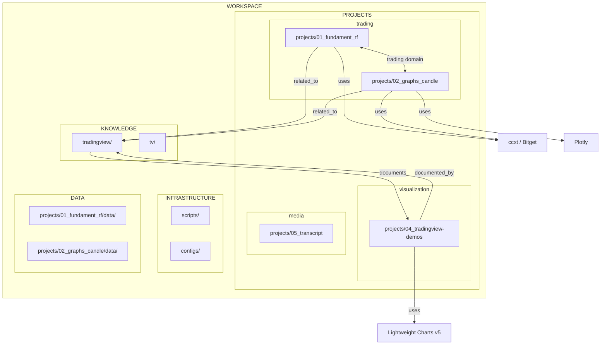
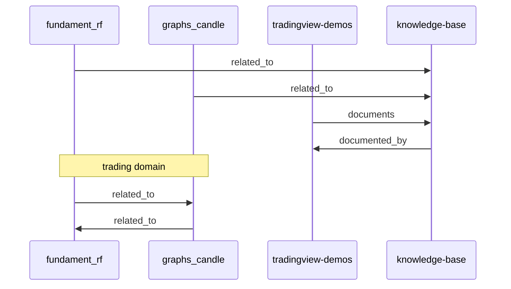
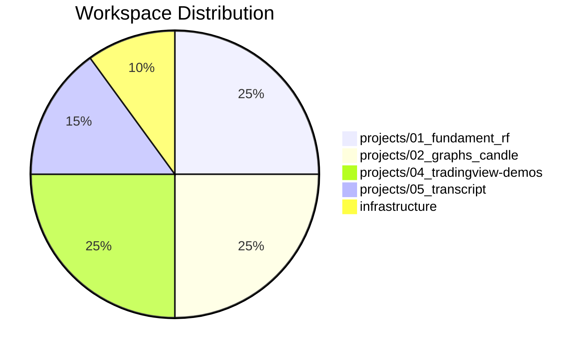

# Mermaid Diagrams

**Файл:** map_mermaid.md
**Родительский:** [map_all_small.md](./map_all_small.md)

---

## 1. Flowchart (диаграмма связей)



---

## 2. Hierarchical (иерархическая диаграмма)

```mermaid
hierarchical
    WORKSPACE
        PROJECTS
            trading
                fundament_rf
                graphs_candle
            visualization
                tradingview-demos
            media
                transcript
        KNOWLEDGE
            tradingview
            tv
        INFRASTRUCTURE
            scripts
            configs
        DATA
```

---

## 3. Sequence диаграмма (зависимости проектов)



---

## 4. Pie Chart (технологии по проектам)


