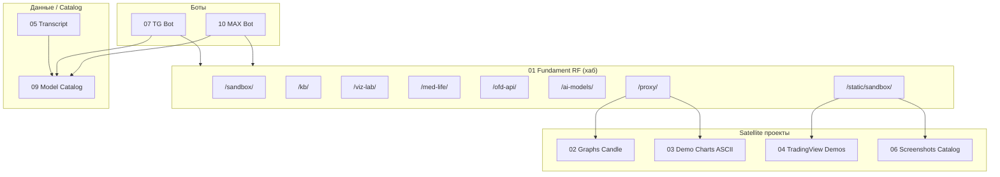
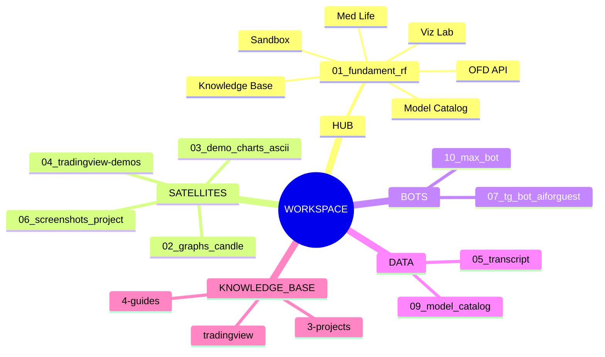

# Mermaid Diagrams

**Файл:** map_mermaid.md
**Родительский:** [map_all_small.md](./map_all_small.md)

---

## 1. Общая архитектура

```mermaid
flowchart TB
    subgraph HUB["01 Fundament RF (хаб)"]
        SANDBOX["/sandbox/"]
        KB["/kb/"]
        VIZ["/viz-lab/"]
        MED["/med-life/"]
        OFD["/ofd-api/"]
        AI["/ai-models/"]
        PROXY["/proxy/"]
        STATIC["/static/sandbox/"]
    end

    subgraph SATELLITES["Satellite проекты"]
        P02["02 Graphs Candle"]
        P03["03 Demo Charts ASCII"]
        P04["04 TradingView Demos"]
        P06["06 Screenshots Catalog"]
    end

    subgraph BOTS["Боты"]
        P07["07 TG Bot"]
        P10["10 MAX Bot"]
    end

    subgraph DATA["Данные / Catalog"]
        P05["05 Transcript"]
        P09["09 Model Catalog"]
    end

    PROXY --> P02
    PROXY --> P03
    STATIC --> P04
    STATIC --> P06
    P07 --> HUB
    P10 --> HUB
    P05 --> P09
    P07 --> P09
    P10 --> P09
```

## 2. Mindmap

```mermaid
mindmap
  root((WORKSPACE))
    HUB
      01_fundament_rf
        Sandbox
        Knowledge Base
        Viz Lab
        Med Life
        OFD API
        Model Catalog
    SATELLITES
      02_graphs_candle
      03_demo_charts_ascii
      04_tradingview-demos
      06_screenshots_project
    BOTS
      07_tg_bot_aiforguest
      10_max_bot
    DATA
      05_transcript
      09_model_catalog
    KNOWLEDGE_BASE
      3-projects
      4-guides
      tradingview
```
